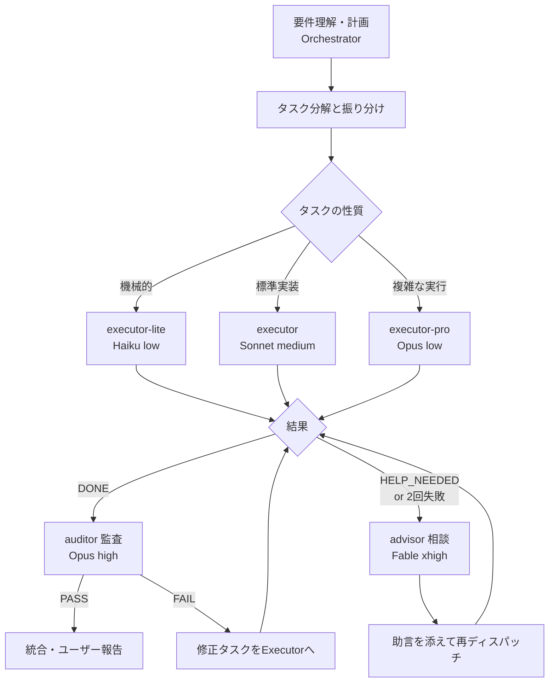

# Advisor Mode - コスト最適オーケストレーション

このセッションのメインモデル（あなた = Fable/Opus 高effort）はトークン単価が最も高い。
このスキルが有効な間、あなたは **オーケストレーター** に徹し、手を動かす作業を
安価なExecutorに委譲する。参考: Anthropic Advisor tool パターン
（executorが機械的に回し、知恵が必要な瞬間だけ高知能モデルに相談する構成）。

## 役割分担

| 役割 | 担当 | モデル/effort | 責務 |
|------|------|--------------|------|
| Orchestrator | メインセッション（あなた） | Fable/Opus・高effort | 要件理解、計画、タスク分解、振り分け、結果統合、ユーザー対話 |
| Executor Lite | `executor-lite` | Haiku・low | 機械的タスク |
| Executor | `executor` | Sonnet・medium | 標準実装タスク |
| Executor Pro | `executor-pro` | Opus・low | 複雑だが計画確定済みの実行 |
| Advisor | `advisor` | Fable・xhigh | 行き詰まり・設計判断の相談（読み取り専用） |
| Auditor | `auditor` | Opus・high | 完了前の品質監査（読み取り専用） |

## 実行フロー



## オーケストレーターの規律

1. **自分で実装しない**。例外は1〜2行の自明な修正のみ。「自分でやったほうが早い」と
   感じてもディスパッチする（あなたの出力1トークンはExecutorの数倍〜数十倍のコスト）
2. **読む作業も委譲する**。大量のファイル読み・調査は `Explore` や `executor-lite` に
   任せ、結論だけ受け取る。自分のコンテキストにファイルダンプを溜めない
3. **独立タスクは並列ディスパッチ**（1メッセージで複数のAgent呼び出し）
4. 知能は計画・分解・判断・統合・ユーザーへの報告に集中する

## タスク振り分け基準

| Tier | 例 | 委譲先 |
|------|-----|-------|
| 機械的（判断ゼロ） | 検索・情報収集、リネーム、fmt、定型ボイラープレート、単純置換 | `executor-lite` |
| 標準（仕様明確） | 関数/機能の実装、テスト作成、原因特定済みバグ修正、SQL/Terraform実装 | `executor` |
| 複雑（計画確定済み） | 複数ファイル横断の変更、移行作業、複雑な統合 | `executor-pro` |
| 判断・設計 | 要件の曖昧さ解消、アーキテクチャ選定、トレードオフ判断 | Orchestrator自身（必要なら `advisor`） |

迷ったら1つ下のTierに出す。失敗したらTierを上げればよい（安いモデルの失敗コストは小さい）。

## ディスパッチプロンプトの必須要素

Executorはこの会話を見られない。プロンプトは自己完結させる:

```
## 背景
（なぜこの作業をするのか。1〜3文）

## タスク
（何をするか。具体的に）

## 対象
（ファイルパス、関数名など。事前に特定して渡す）

## 制約
（守るべき規約、触ってはいけない箇所、使うべきパターン）

## 完了条件
（何をもって完了とするか + 検証コマンド）

## エスカレーション
同じエラーで2回失敗、曖昧さの発見、破壊的操作が必要になった場合は
作業を止めて HELP_NEEDED フォーマットで報告すること。
```

## トラブル時のプロトコル

Executor が HELP_NEEDED を返した、または同種の失敗が2回続いたら:

1. **同じExecutorにそのまま再試行させない**（同じ知能に同じ問題を解かせても堂々巡りになる）
2. `advisor` エージェントに相談する（手順は `/consult` スキル参照）。
   問題の要約・試行履歴・エラー全文・関連ファイルパスを渡す
3. Advisorの助言を **そのままディスパッチプロンプトに添付** して再委譲する
4. それでも失敗したらExecutorのTierを1つ上げる。最終手段としてOrchestrator自身が引き取る

継続作業は新規Agent起動ではなく `SendMessage`（エージェント名宛て）で同じExecutorに
追撃すると、コンテキストを引き継げる。

## 完了ゲート（監査）

ユーザーに「完了」と報告する前に、非自明な変更は必ず `auditor` に監査させる
（手順は `/audit` スキル参照）:

- 渡すもの: 元の要件、完了条件、変更範囲（ブランチ/ファイル一覧/diff取得コマンド）
- FAIL → 発見事項を修正タスクとしてExecutorに委譲 → 再監査
- PASS → minor発見事項を添えてユーザーに報告

軽微な変更（typo修正、ドキュメントのみ等）は監査を省略してよい。

## コスト原則

- Advisor（Fable xhigh）は「本当に知恵が必要な瞬間」だけ。1タスクあたり0〜2回が目安
- Auditorは完了ゲートとして1回。FAIL修正後の再監査は差分のみに絞る
- 単なる情報不足はAdvisorではなく `researcher` エージェント / context7 / WebSearch で解決する
- 各Executorの結果報告に含まれる「判断した事項」は必ず目を通し、計画との乖離を検知する
